## Pasos para crear un Boot en Teams

1.- Entramos a [QnA Maker](https://www.qnamaker.ai/)

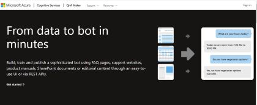

2.- Iniciamos sesion.

3.-  Le daremos en donde dice **Create a Knowledge base**

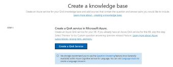

4.- le damos en crear un QnA service y nos mandra a azure.

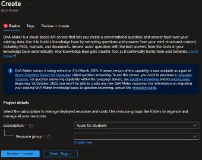

5.- Llenamos los datos y le damos en revisar y crear, para que despues le demos crear.

6.- Nos regresamos a la pagina de qnmaker y seleccionamos nuestroo QnA service y le damos un idioma.

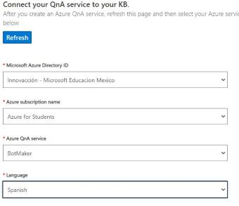

**Nota: Un aves que seleccionas el idioma, ya no lo puedes cambiar.**

7.- Le ponemos un nombre al bot.

8.- Le ponemos una personalidad al bot.

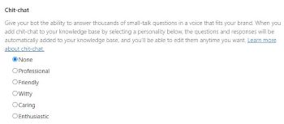

9.- Le damos ahora en **Create your KB**.

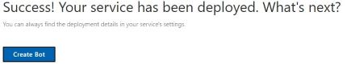

10.- Una ves creada, vamos a generar pares de prgeuntas y respues dandole en **Add QnA pair**.

11.- Añadimos una pregunta, con una respuesta.
12.- Para añadir otra pregunta, le volvemos a dar en **Add QnA Pair**.

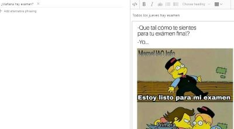

13.- Una vez que acabemos, le damos en **save and train**.

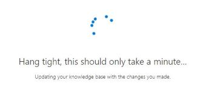

14.- Ahora ya que acabo, le daremos en **Test** para ver que funcione bien.

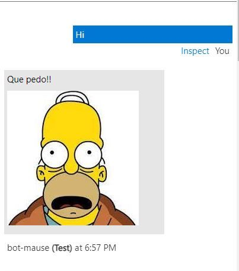

15.- Ahora le daremos en Publish

16.- le daremos ahora en create bot.

17.-  Aca lo unico que cambiaremos, el el precio y el SDK languaje.Y le damos en crear.

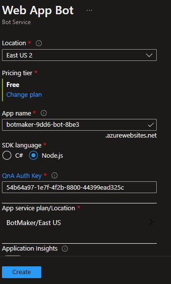

18.- Esperemos a que cre cree el bot, va a tardar un poco

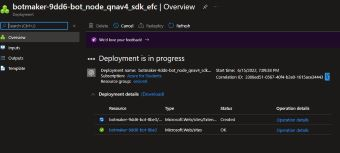

19.- Lo vamos a meter a canales, ya sea de wasap, face o teams.

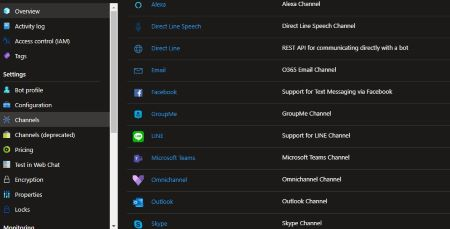

20.- Le dare en Teams y le damos de acuerdo, ahora en aplicar.

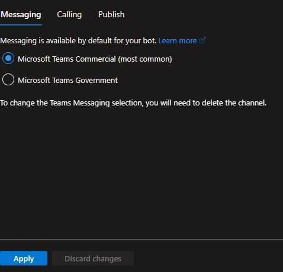

21.- Nos salimos de ahi y regresamos a Canales, ahora solo debemos dar en **Abrir en teams**.

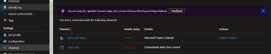

22.- Y haremos lo mismo, escribir Hola y nos mandara un mensaje. FIN.

------------------------------------------------------------------------
